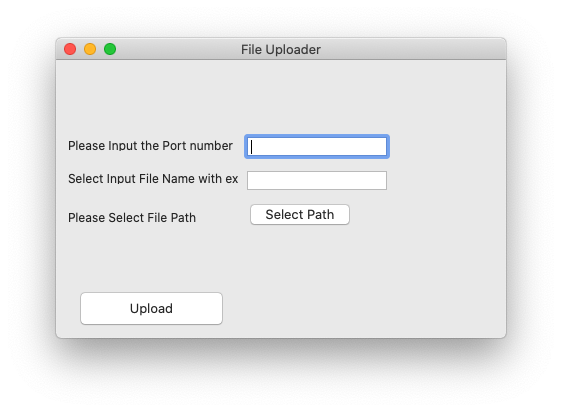

# Swing-File-Transfer
 An application to transfer files from one computer to another.
 The file could be of any arbitray size, and the transfer speed depends upon the upload and donwload speeds of the terminals.
 
 
 To run the application, please ensure that you have the appropriate JAR files linked with the project. Project GUI was built using JAVA SWING Window Builder.
 Run Downloader_GUI.java and Uploader_GUI.java, then supply the information required in the text fields of the GUI.
 
 
